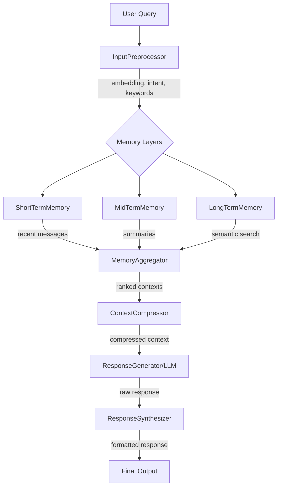

# 🧠 Memory Layer Lab

**Experimental chatbot with multi-layer memory system**

A modular, configurable chatbot with:
- 🔄 Multi-layer memory (STM, MTM, LTM)
- 🔍 Semantic search with embeddings
- 📊 Langfuse tracing & observability
- 🗄️ Neo4j support (optional)
- 🎛️ Easy configuration via UI

**✅ STATUS: Ready for experimentation!**

## Project Structure

```
memory_layer_lab/
│
├── main.py                 # Entrypoint for the chatbot
├── config.py               # Configuration (memory size, DB, API keys)
├── demo_workflow.py        # Demo of complete workflow
├── test_simple.py          # Simple tests
│
├── core/                   # Core modules
│   ├── __init__.py
│   ├── short_term.py       # Short-term memory (with embedding search)
│   ├── mid_term.py         # Mid-term memory (enhanced with Neo4j MTM)
│   ├── long_term.py        # Long-term memory (enhanced with Neo4j + VectorDB)
│   ├── summarizer.py       # Summarization module
│   ├── orchestrator.py     # Memory layer orchestration
│   ├── preprocessor.py     # Input preprocessing & embeddings
│   ├── aggregator.py       # Multi-layer context aggregation
│   ├── compressor.py       # Context compression
│   └── synthesizer.py      # Response synthesis & formatting
│
├── mtm/                    # NEW: Mid-term Memory with Neo4j
│   ├── __init__.py
│   ├── temporal_graph.py   # Temporal graph (commit timeline)
│   ├── knowledge_graph.py  # Knowledge graph (code relationships)
│   └── query.py            # Unified MTM query interface
│
├── ltm/                    # NEW: Long-term Memory with Neo4j + VectorDB
│   ├── __init__.py
│   ├── knowledge_graph.py  # LTM knowledge graph (design docs, concepts)
│   ├── vecdb.py            # Vector database (FAISS/ChromaDB/Qdrant)
│   └── query.py            # Unified LTM query interface
│
├── bot/                   
│   ├── __init__.py
│   ├── chatbot.py         # ChatBot class (advanced workflow)
│   └── response.py        # Response generation
│
└── utils/
    ├── __init__.py
    ├── logger.py          # Logging utilities
    └── storage.py         # Storage utilities (file/DB)
```

## 🚀 Quick Start

```bash
# 1. Install dependencies
pip install -r requirements.txt

# 2. (Optional) Install semantic search
pip install sentence-transformers scikit-learn

# 3. (Optional) Install Langfuse for tracing
pip install langfuse

# 4. Run chatbot
python main.py

# 5. (Optional) Launch config UI
python config_ui.py  # http://localhost:7861
```

## ⚙️ Configuration

### Via Config UI (Recommended)
```bash
python config_ui.py  # http://localhost:7861
```
Adjust parameters via web interface:
- Compression settings
- Memory layer sizes
- Semantic search thresholds
- LLM parameters

### Via Config File
Edit `config/system_config.yaml`:
```yaml
compression:
  strategy: "score_based"  # or mmr, truncate
  max_tokens: 1000
  
semantic_search:
  enabled: true
  similarity_threshold: 0.6
  
response_generation:
  model: "gpt-4o-mini"
  temperature: 0.7
```

### Langfuse Tracing (Optional)
1. Get API keys from https://cloud.langfuse.com
2. Edit `config/langfuse_config.yaml`
3. Set `langfuse.enabled: true` in system_config.yaml

### Neo4j (Optional)
1. Install Neo4j
2. Edit `config/neo4j_config.yaml`
3. Run `python test_neo4j_connection.py`

## ✨ Features

### 🧠 Memory Layers
- **STM**: Recent messages (default: 10)
- **MTM**: Summarized chunks (default: 100)
- **LTM**: Long-term facts with Neo4j support

### 🔍 Semantic Search
- Real embeddings with sentence-transformers
- Cosine similarity ranking
- Top-K retrieval from each layer

### 🗜️ Context Compression
- Multiple strategies (score-based, MMR, truncate)
- Configurable weights (importance, recency, relevance)
- Token budget management
### 📊 Observability
- Langfuse integration for tracing
- Performance metrics
- LLM call tracking

## 💻 Usage Examples

### Run Tests
```bash
# Generate embedded test data
python generate_embedded_data.py

# Test semantic search
python test_semantic_search.py

# Test Neo4j connection
python test_neo4j_connection.py

# Run comprehensive tests
python test_comprehensive.py
```

### Adjust Config Programmatically
```python
from utils.config_manager import get_config

config = get_config()

# Get value
max_tokens = config.get("compression.max_tokens")

# Set value
config.set("compression.max_tokens", 2000, save=True)

# Update multiple
config.update({
    "compression.strategy": "mmr",
    "semantic_search.top_k_stm": 10
}, save=True)
```

### Use Langfuse Tracing
```python
from utils.langfuse_client import create_langfuse_client, LangfuseTracer

client = create_langfuse_client()
tracer = LangfuseTracer(client)

@tracer.trace_llm_call(model="gpt-4")
def generate_response(prompt):
    return llm.generate(prompt)

# Auto-traced!
response = generate_response("Hello")
client.flush()
```

## 🏗️ Architecture



## 📂 Key Files

**Core:**
- `core/orchestrator.py` - Memory orchestration
- `core/compressor.py` - Context compression
- `core/aggregator.py` - Multi-layer aggregation

**Configuration:**
- `config/system_config.yaml` - Main config (200+ parameters)
- `config_ui.py` - Web UI for config adjustment
- `utils/config_manager.py` - Config management

**Tracing:**
- `utils/langfuse_client.py` - Langfuse integration
- `examples/langfuse_example.py` - Usage examples

**Testing:**
- `test_semantic_search.py` - Semantic search tests
- `test_comprehensive.py` - Full system tests
- `generate_embedded_data.py` - Test data generation

## 📚 Documentation

**Essential Guides:**
- This README - Quick start & overview
- `config/system_config.yaml` - All configurable parameters (with comments)

**Setup Guides (if needed):**
- Neo4j: Run `python test_neo4j_connection.py` for help
- Langfuse: Edit `config/langfuse_config.yaml.example`

## 🔬 Experimentation

This is a **lab project** for testing different memory strategies:

```python
# Try different compression strategies
for strategy in ["score_based", "mmr", "truncate"]:
    config.set("compression.strategy", strategy, save=True)
    results = run_tests()
    print(f"{strategy}: {results}")

# Find optimal weights
for imp_weight in [0.3, 0.4, 0.5, 0.6]:
    config.set("compression.importance_weight", imp_weight, save=True)
    # Adjust other weights...
    results = run_tests()
```

## License

MIT License
