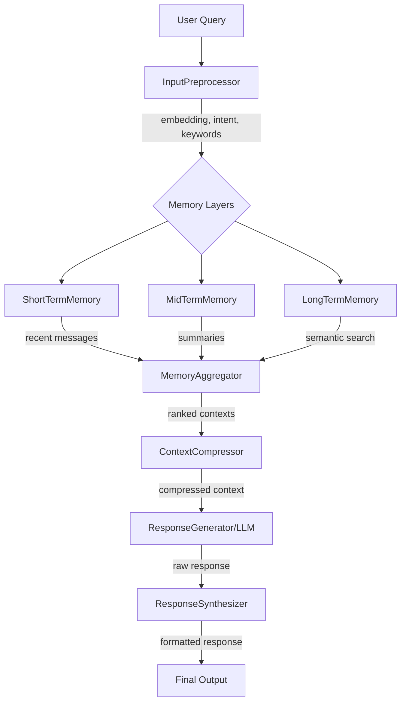

# Memory Layer Lab

A modular chatbot system with configurable memory layers (short-term, mid-term, and long-term) for managing conversation context.

**NEW**: Enhanced with **Neo4j graph databases** and **Vector DB** for advanced memory management!

**✅ STATUS: FULLY OPERATIONAL** - All tests passing, examples working, ready to use!

## Project Structure

```
memory_layer_lab/
│
├── main.py                 # Entrypoint for the chatbot
├── config.py               # Configuration (memory size, DB, API keys)
├── demo_workflow.py        # Demo of complete workflow
├── test_simple.py          # Simple tests
│
├── core/                   # Core modules
│   ├── __init__.py
│   ├── short_term.py       # Short-term memory (with embedding search)
│   ├── mid_term.py         # Mid-term memory (enhanced with Neo4j MTM)
│   ├── long_term.py        # Long-term memory (enhanced with Neo4j + VectorDB)
│   ├── summarizer.py       # Summarization module
│   ├── orchestrator.py     # Memory layer orchestration
│   ├── preprocessor.py     # Input preprocessing & embeddings
│   ├── aggregator.py       # Multi-layer context aggregation
│   ├── compressor.py       # Context compression
│   └── synthesizer.py      # Response synthesis & formatting
│
├── mtm/                    # NEW: Mid-term Memory with Neo4j
│   ├── __init__.py
│   ├── temporal_graph.py   # Temporal graph (commit timeline)
│   ├── knowledge_graph.py  # Knowledge graph (code relationships)
│   └── query.py            # Unified MTM query interface
│
├── ltm/                    # NEW: Long-term Memory with Neo4j + VectorDB
│   ├── __init__.py
│   ├── knowledge_graph.py  # LTM knowledge graph (design docs, concepts)
│   ├── vecdb.py            # Vector database (FAISS/ChromaDB/Qdrant)
│   └── query.py            # Unified LTM query interface
│
├── bot/                   
│   ├── __init__.py
│   ├── chatbot.py         # ChatBot class (advanced workflow)
│   └── response.py        # Response generation
│
└── utils/
    ├── __init__.py
    ├── logger.py          # Logging utilities
    └── storage.py         # Storage utilities (file/DB)
```

## Setup

1. Clone the repository
2. Install dependencies: `pip install -r requirements.txt`
3. Configure your settings in `config.py`
4. Run the chatbot: `python main.py`

### Quick Start

```bash
# Install dependencies
pip install -r requirements.txt

# Optional: Start Neo4j (for graph features)
docker-compose up -d neo4j

# Run simple tests
python test_simple.py

# Run workflow demo
python demo_workflow.py

# Run Neo4j demo (works without Neo4j in mock mode)
python demo_neo4j.py

# Populate data from schema.yaml
python populate_from_schema.py

# Quick embedding example
python example_embedding_usage.py

# Run interactive chatbot
python main.py
```

## Configuration

Edit `config.py` to configure:
- **Memory layer sizes**: Control how many messages/chunks each layer stores
- **Database connections**: Configure SQLite, PostgreSQL, or MongoDB
- **API keys**: Add your LLM API keys (OpenAI, Anthropic, etc.)
- **Logging preferences**: Set log level and output format

## Features

### Memory Layers

1. **Short-term Memory**
   - Stores recent messages (default: 10)
   - Has TTL (time-to-live) for automatic cleanup
   - Fast access for immediate context

2. **Mid-term Memory** (Enhanced with Neo4j)
   - Stores summarized conversation chunks (default: 100)
   - **NEW: Temporal Graph** - Commit timeline with Neo4j
   - **NEW: Knowledge Graph** - Code relationships (functions, classes, modules)
   - Automatically summarizes when short-term fills up
   - Query code history and relationships

3. **Long-term Memory** (Enhanced with Neo4j + Vector DB)
   - **NEW: Knowledge Graph** - Design docs, domain concepts with Neo4j
   - **NEW: Vector Database** - Semantic search with FAISS/ChromaDB
   - Persistent knowledge across sessions
   - Concept hierarchy and relationships
   - Document similarity search

### Response Modes

- **Mock Mode**: For testing without API costs
- **LLM Mode**: Integration with OpenAI, Anthropic, etc. (TODO)
- **Rule-based Mode**: Simple keyword matching

## Usage

### Basic Usage

```bash
# Run the chatbot in interactive mode
python main.py
```

### Interactive Commands

- **Regular chat**: Just type your message
- **`stats`**: View conversation statistics
- **`reset`**: Clear all memory
- **`quit` / `exit`**: Save and exit

### Example Session

```
You: Hello! What can you do?
MemoryBot: Hello! How can I help you today?

You: Tell me about Python
MemoryBot: That's interesting! Regarding 'Tell me about Python', here's what I think...

You: stats
--- Conversation Statistics ---
Bot Name: MemoryBot
Short-term messages: 4
Mid-term chunks: 0
-------------------------------
```

## Architecture

### Advanced Workflow (Implemented)



### Workflow Steps

1. **Input Preprocessing**
   - Normalize text
   - Detect intent (code_search, debug, documentation, etc.)
   - Generate embeddings (mock or real model)
   - Extract keywords

2. **Memory Retrieval**
   - STM: Recent messages with embedding similarity search
   - MTM: Summarized chunks with relevance scoring
   - LTM: Long-term knowledge (placeholder)

3. **Context Aggregation**
   - Merge contexts from all layers
   - Deduplicate similar items
   - Rank by relevance scores (weighted by layer importance)

4. **Context Compression**
   - Fit context within token budget
   - Preserve most important items
   - Use strategies: truncation, score-based, MMR

5. **Response Generation**
   - Generate response with compressed context
   - Post-process and format
   - Add metadata and citations

## Development

### Running Tests

```bash
# Install dev dependencies
pip install -r requirements.txt

# Run tests (when implemented)
pytest tests/

# Type checking
mypy .

# Code formatting
black .
```

### Extending the System

1. **Custom Summarizer**: Implement new summarization strategies in `core/summarizer.py`
2. **LLM Integration**: Add API calls in `bot/response.py`
3. **Database Support**: Extend `utils/storage.py` for different databases
4. **Long-term Memory**: Implement vector search in `core/long_term.py`

## Future Enhancements

- [ ] LLM integration (OpenAI, Anthropic)
- [ ] Vector database for semantic search
- [ ] Web interface (Flask/FastAPI)
- [ ] Multi-user support
- [ ] Conversation export/import
- [ ] Advanced summarization algorithms
- [ ] Plugin system for custom memory layers

## License

MIT License
